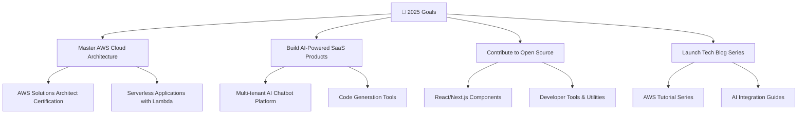

# 🚀 Rohan Ramesh Kadukar

<div align="center">
  
</div>

<p align="center">
  
  
  
</p>

<div align="center">
  
</div>

---

## 🌟 About Me


```javascript
const rohan = {
    pronouns: "He/Him",
    location: "Gadhinglaj, Maharashtra, India 🇮🇳",
    education: {
        current: "M.Sc. Computer Science (2023-2025)",
        university: "Modern College, Ganeshkhind (SPPU)",
        cgpa: "81.09%",
        previous: "B.Sc. Computer Science (82.36%)"
    },
    currentFocus: [
        "Full Stack Development",
        "AI Integration & Chatbots",
        "AWS Cloud Services",
        "DevOps & CI/CD"
    ],
    funFact: "I debug code and life problems with equal enthusiasm! 🐛✨"
};
```

🎯 **Current Role**: Internship Trainee at SparkLab IT Solutions Pvt. Ltd. (Jan 2025 – Jun 2025)

🔭 **Working On**: Abhinav Academy Website with AI Chatbot Integration

🌱 **Learning**: AWS Lambda, API Gateway, Kubernetes, Prompt Engineering

💡 **Passionate About**: Building scalable applications, AI-driven solutions, and modern web frameworks

📧 **Reach Me**: rohankadukar12@gmail.com | +91 7558732173

---

## 🌐 Connect With Me

<p align="center">
  <a href="https://github.com/rohan-kadukar" target="_blank">
    
  </a>
  <a href="https://www.linkedin.com/in/rohan-kadukar/" target="_blank">
    
  </a>
  <a href="https://rohatech.site" target="_blank">
    
  </a>
  <a href="mailto:rohankadukar12@gmail.com" target="_blank">
    
  </a>
  <a href="https://blog.rohatech.site" target="_blank">
    
  </a>
</p>

<p align="center">
  <a href="https://facebook.com/rohan-kadukar" target="_blank">
    
  </a>
  <a href="https://instagram.com/rohan_kadukar" target="_blank">
    
  </a>
</p>

---

## 🛠️ Tech Arsenal

<details>
<summary><b>🎨 Frontend Technologies</b></summary>
<br>
<p align="center">
  
</p>
</details>

<details>
<summary><b>⚙️ Backend & Database</b></summary>
<br>
<p align="center">
  
</p>
</details>

<details>
<summary><b>☁️ Cloud & DevOps</b></summary>
<br>
<p align="center">
  
</p>
</details>

<details>
<summary><b>🤖 AI & Data Science</b></summary>
<br>
<p align="center">
  
  
  
</p>
</details>

<details>
<summary><b>🔧 Tools & IDEs</b></summary>
<br>
<p align="center">
  
</p>
</details>

---

## 🚀 Featured Projects

<div align="center">
  
</div>

### 🎓 Abhinav Academy Website & AI Chatbot
<p align="center">
  
  
  
  
  
</p>

**🎯 Official educational platform with intelligent AI assistant**

**✨ Highlights:**
- 🤖 **Smart AI Chatbot** - Context-aware responses with Gemini API
- 🌐 **Multilingual Support** - Marathi, Hindi, English detection
- 📊 **Analytics Dashboard** - MongoDB logging for insights
- 🔒 **Enterprise Security** - JWT tokens, CORS, environment variables
- 🚀 **Auto Deployment** - GitHub Actions CI/CD pipeline
- 💾 **Context Management** - Token limit optimization with summarization

**🌟 [Live Demo](https://abhinavedu.org) | [📁 Source Code](https://github.com/rohan-kadukar/abhinav-academy-website)**

---

### 💻 Chikode - Code Playground
<p align="center">
  
  
  
</p>

**🎯 Online code editor and snippet manager for developers**

**✨ Features:**
- ⚡ Real-time code editing with syntax highlighting
- 📂 Save, tag, and organize code snippets
- 🔗 Shareable links for collaboration
- 🎨 Multiple themes and language support

**🌟 [Live Demo](https://chikode.rohatech.site)**

---

### 🌍 Speak Simple Translator
<p align="center">
  
  
</p>

**🎯 Instant translation tool with clean, intuitive interface**

**✨ Features:**
- 🌐 Multi-language translation support
- 💾 Translation history and favorites
- 📱 Responsive design for all devices
- ⚡ Lightning-fast serverless functions

**🌟 [Live Demo](https://speaksimpletranslator.rohatech.site/)**

---

### 🤖 Personal Chatbot Buddy
<p align="center">
  
  
</p>

**🎯 Personal AI assistant for productivity and creativity**

**✨ Features:**
- 🧠 Customizable AI personalities
- 💬 Context-aware conversations
- 📝 Note-taking and reminders
- 🎨 Creative brainstorming modes

**🌟 [Live Demo](https://personal-chatbot-buddy.vercel.app)**

---

### 🛒 E-Commerce Solutions

<details>
<summary><b>🥜 Keshaw Nuts Selling Website</b></summary>
<br>
<p align="center">
  
  
  
</p>

**Features:**
- 🛍️ Complete e-commerce functionality
- 👨‍💼 Admin panel for inventory management
- 💳 Secure payment integration
- 📱 Mobile-responsive design

**[📁 Source Code](https://github.com/rohan-kadukar/keshaw-nuts-selling)**
</details>

<details>
<summary><b>🏪 Grocery Management System</b></summary>
<br>
<p align="center">
  
  
  
</p>

**Features:**
- 📦 Inventory management with CRUD operations
- 🧾 Billing system with printable receipts
- 📊 Sales reports and analytics
- ⚠️ Low stock alerts

**[📁 Source Code](https://github.com/rohan-kadukar/grocery-management-system)**
</details>

---

## 📊 GitHub Analytics

<div align="center">
  
</div>

<p align="center">
  
  
</p>

<p align="center">
  
  
</p>

---

## 🏆 Achievements & Trophies

<div align="center">
  
</div>

<div align="center">
  
</div>

---

## 📝 Latest Blog Posts & Articles

<div align="center">
  
</div>

<!-- BLOG-POST-LIST:START -->
📄 **Technical Insights & Tutorials**
- 🔐 **Secure Authentication Patterns** - JWT vs Sessions
- ⚡ **Performance Optimization** - React & Next.js Best Practices  
- 🤖 **AI Chatbot Development** - Prompt Engineering Techniques
- ☁️ **AWS Serverless Architecture** - Lambda, API Gateway, DynamoDB
- 🐳 **Docker & Kubernetes** - Container Orchestration Guide
<!-- BLOG-POST-LIST:END -->

**📖 [Read All Articles](https://blog.rohatech.site)**

---

## 🎯 Current Goals & Roadmap



---

## 💭 Philosophy & Approach

<div align="center">
  
</div>

> **"Code is like humor. When you have to explain it, it's bad."** – Cory House

**🚀 My Development Philosophy:**
- 🎯 **User-Centric Design** - Build for people, not just technology
- 🔧 **Clean Architecture** - Maintainable, scalable, and testable code
- 🌟 **Continuous Learning** - Embrace new technologies and methodologies
- 🤝 **Collaboration** - Great software is built by great teams
- 📊 **Data-Driven** - Make decisions based on metrics and user feedback

---

## 📈 Contribution Graph

<div align="center">
  
  
</div>

---

## 🎵 Currently Vibing To

<div align="center">
  <a href="https://spotify-github-profile.vercel.app/api/view?uid=31k6w3pz3fu4j7qejsxj2xa7gd24&redirect=true">
    
  </a>
</div>

---

## 🤝 Let's Collaborate!

<div align="center">
  
</div>

**🌟 I'm always excited to work on:**
- 🚀 Innovative web applications
- 🤖 AI-powered solutions
- ☁️ Cloud-native architectures
- 📱 Mobile-first experiences
- 🌐 Open source contributions

**📞 Get in touch:**

<p align="center">
  <a href="mailto:rohankadukar12@gmail.com">
    
  </a>
  <a href="https://www.linkedin.com/in/rohan-kadukar/">
    
  </a>
  <a href="https://rohatech.site">
    
  </a>
</p>

---

<div align="center">
  
</div>

<div align="center">
  <b>⭐ Don't forget to star my repositories if you find them useful! ⭐</b>
</div>

<p align="center">
  
</p>

<p align="center">
  <i>© 2025 Rohan Ramesh Kadukar. Made with ❤️ and lots of ☕</i>
</p>
