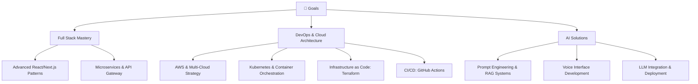

# 🚀 Rohan Ramesh Kadukar

<div align="center">
  
</div>

<div align="center">
  <picture>
    <source media="(max-width: 600px)" srcset="https://user-images.githubusercontent.com/74038190/212284100-561aa473-3905-4a80-b561-0d28506553ee.gif">
    
  </picture>
</div>

<p align="center">
  
  
  
  
</p>

---

## 🌟 About Me

```javascript
const rohan = {
    pronouns: "He/Him",
    role: "Junior Full Stack Developer @ SparkLab IT Solutions",
    location: "Gadhinglaj, Maharashtra, India 🇮🇳",
    education: {
        current: "M.Sc. Computer Science (2023–2025)",
        university: "Modern College, Ganeshkhind (SPPU)",
        cgpa: "9.05",
        previous: "B.Sc. Computer Science, Shivraj College (Shivaji University)",
        previousCgpa: "9.14"
    },
    experience: "1+ Years Professional Software Experience",
    currentFocus: [
        "Full Stack Development (React, Next.js, Node.js, TypeScript)",
        "REST APIs, Microservices & Real-Time Systems (Socket.IO)",
        "AI Chatbot & Gemini API Integration",
        "DevOps & Cloud-native Architectures"
    ],
    funFact: "I automate everything - from code deployments to coffee brewing schedules! ☕🤖"
};
```

### 🎯 **Professional Journey**
- 💼 **Junior Full Stack Developer** | SparkLab IT Solutions | Jul 2025 – Present | Gadhinglaj, Maharashtra
  - Building production-ready business web apps with React.js, Next.js, Node.js, TypeScript, Express.js, MySQL & Socket.IO
- 🌱 **Winter Intern** | SparkLab IT Solutions | Jan 2025 – Jun 2025 | Kolhapur, Maharashtra
  - Built the **Abhinav Academy Website** & integrated an **AI Chatbot** (Gemini API)
- 🎓 **M.Sc. in Computer Science** | Modern College, Ganeshkhind (SPPU) | 2023–2025 | CGPA: **9.05**
- 🎓 **B.Sc. in Computer Science** | Shivraj College, Gadhinglaj (Shivaji University) | 2021–2023 | CGPA: **9.14**
- 📜 **Certifications**: Angular & NodeJS – The MEAN Stack Guide, Angular – The Complete Guide (Udemy)
- 📧 **Contact**: [rohankadukar12@gmail.com](mailto:rohankadukar12@gmail.com)
- 🌐 **Portfolio**: [rohan-kadukar.vercel.app](https://rohan-kadukar.vercel.app)

---

## 🌐 Connect With Me

<p align="center">
  <a href="https://github.com/rohan-kadukar" target="_blank">
    
  </a>
  <a href="https://www.linkedin.com/in/rohan-kadukar/" target="_blank">
    
  </a>
  <a href="https://rohan-kadukar.vercel.app" target="_blank">
    
  </a>
  <a href="mailto:rohankadukar12@gmail.com" target="_blank">
    
  </a>
  <a href="https://rohan-kadukar.blogspot.com" target="_blank">
    
  </a>
</p>

---

## 🛠️ Tech Arsenal

<details>
<summary><b>🎨 Frontend</b></summary>
<br>
<p align="center">
  
</p>
</details>

<details>
<summary><b>⚙️ Backend & Databases</b></summary>
<br>
<p align="center">
  
  
  
</p>
</details>

<details>
<summary><b>☁️ Cloud, DevOps & Tools</b></summary>
<br>
<p align="center">
  
</p>
</details>

<details>
<summary><b>🤖 AI Integration</b></summary>
<br>
<p align="center">
  
</p>
</details>

---

## 🚀 Featured Projects

### 🎓 Educational Platform — Abhinav Academy
Responsive Next.js website with SEO optimization, Laravel API integration, and an AI-powered chatbot (Gemini API) for student assistance.
`Next.js` `Tailwind CSS` `Laravel REST API` `Gemini API`
**🔗 Live**: [abhinavedu.org](https://abhinavedu.org)

### 🧾 Invoice & Quotation Management System
Web-based quotation/invoice platform for small businesses — automated tax & total calculations, PDF generation, customer & product management.
`React.js` `TypeScript` `Node.js` `Express.js` `MySQL`
**🔗 Live**: [sparklab-quote.vercel.app](https://sparklab-quote.vercel.app/)

### 👥 Employee Management System
Role-based employee management platform with secure authentication, task assignment, leave management, and expense approval workflows.
`React.js` `TypeScript` `Bootstrap` `REST API`
**🔗 Live**: [admin.chikodebuildingmaterials.com](https://admin.chikodebuildingmaterials.com/)

### 📍 Employee Tracking Microservice
Standalone microservice for real-time employee location tracking with secure APIs, location history logging, and Socket.IO live sync.
`Node.js` `Express.js` `MySQL` `Socket.IO`

### 💬 Real-Time Chat Microservice
Standalone chat microservice for the employee management system — group channels, 1-on-1 messaging, typing indicators, read receipts.
`React.js` `Node.js` `Express.js` `Socket.IO` `MySQL`

### 🤖 AI Chatbot Platform
Reusable AI + rule-based chatbot platform with an embeddable widget script for easy multi-site integration, powered by Gemini API.
`React.js` `Node.js` `Google Gemini API` `Tailwind CSS`

### 📊 CRM System
CRM modules with role-based access, interactive dashboards, customer/lead workflow tracking, and REST API integration.
`React.js` `TypeScript` `Node.js` `Express.js` `MySQL`

**🔍 Explore More**: [github.com/rohan-kadukar](https://github.com/rohan-kadukar?tab=repositories)

---

## 🎯 Current Learning Journey & Roadmap


```mermaid
graph TD
  A[🎯 Goals] --> B[Full Stack Mastery]
  A --> C[DevOps & Cloud Architecture]
  A --> D[AI Solutions]

  B --> B1[Advanced React/Next.js Patterns]
  B --> B2[Microservices & API Gateway]

  C --> C1[AWS & Multi-Cloud Strategy]
  C --> C2[Kubernetes & Container Orchestration]
  C --> C3[Infrastructure as Code: Terraform]
  C --> C4[CI/CD: GitHub Actions]

  D --> D1[Prompt Engineering & RAG Systems]
  D --> D2[Voice Interface Development]
  D --> D3[LLM Integration & Deployment]
```

---

## 💭 Technical Philosophy

> **"Bridge the gap between traditional development and modern solutions, automate intelligently, and build systems that scale with human creativity."**

- **🔄 Hybrid Development** — Leverage traditional coding and modern platforms for optimal solutions
- **🤖 AI-First Automation** — Integrate intelligent automation into every workflow
- **☁️ Cloud-Native Architecture** — Design for scalability, resilience, and global accessibility
- **🔒 Security by Design** — JWT auth, RBAC, and zero-trust principles from the ground up
- **⚡ Continuous Innovation** — Experiment with emerging tech while maintaining production stability
- **👥 User-Centric Design** — Prioritize accessibility, performance, and intuitive UX

---

## 📈 GitHub Analytics

<div align="center">
  
  
</div>

<div align="center">
  
</div>

---

## 🤝 Collaboration & Opportunities

**🌟 Open to:**
- 🚀 Full-Stack Development Projects — modern web apps with AI integration
- ☁️ Cloud Architecture Consulting — multi-cloud & DevOps implementation
- 🤖 AI Product Development — conversational interfaces & automation
- 🛠️ Open Source Contributions — JavaScript frameworks, AI tools, DevOps utilities
- 📚 Knowledge Transfer — technical writing, mentorship

**💡 Expertise Areas:**
- Modern full-stack web development (React, Next.js, Node.js, TypeScript)
- REST APIs, microservices & real-time systems (Socket.IO)
- AI-powered application development (Gemini API)
- MySQL / Sequelize database design

<p align="center">
  
</p>

📧 **Contact**: [rohankadukar12@gmail.com](mailto:rohankadukar12@gmail.com)
🌐 **Portfolio**: [rohan-kadukar.vercel.app](https://rohan-kadukar.vercel.app)

<div align="center">
  <picture>
    
  </picture>
</div>

<p align="center">
  <i>© 2026 Rohan Ramesh Kadukar. Crafted with ❤️, powered by ☕, and automated with 🤖.</i>
</p>

<div align="center">
 
</div>
