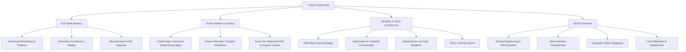

# 🚀 Rohan Ramesh Kadukar

<div align="center">
  
</div>

<div align="center">
  <picture>
    <source media="(max-width: 600px)" srcset="https://user-images.githubusercontent.com/74038190/212284100-561aa473-3905-4a80-b561-0d28506553ee.gif">
    
  </picture>
</div>

<p align="center">
  
  
  
</p>

<div align="center">
  <picture>
    <source media="(max-width: 600px)" srcset="https://user-images.githubusercontent.com/74038190/225813708-98b745f2-7d22-48cf-9150-083f1b00d6c9.gif">
    
  </picture>
</div>

---

## 🌟 About Me

<div align="left">
  <picture style="float: right; margin-left: 20px;">
    <source media="(max-width: 768px)" srcset="https://raw.githubusercontent.com/devSouvik/devSouvik/master/gif3.gif">
    
  </picture>
</div>

```javascript
const rohan = {
    pronouns: "He/Him",
    location: "Gadhinglaj, Maharashtra, India 🇮🇳",
    education: {
        current: "M.Sc. Computer Science (2023–2025)",
        university: "Modern College, Ganeshkhind (SPPU)",
        cgpa: "81.09%",
        previous: "B.Sc. Computer Science (82.36%)"
    },
    currentFocus: [
        "Full Stack Development",
        "AI/AGI Integration & Chatbots/Voice Assistants", 
        "DevOps & Cloud-native Architectures",
        "Microsoft Power Platform Learning"
    ],
    funFact: "I automate everything - from code deployments to coffee brewing schedules! ☕🤖"
};
```

<div align="center">
  <picture>
    
  </picture>
</div>

### 🎯 **Professional Journey**
- 🎓 **M.Sc. in Computer Science** | Modern College, Ganeshkhind (SPPU) | 2023–2025 | CGPA: **81.09%**
- 🎓 **B.Sc. in Computer Science** | Shivraj College, Gadhinglaj (Shivaji University) | 2021–2023 | CGPA: **82.36%**
- 🏆 **Internship Trainee** | SparkLab IT Solutions Pvt. Ltd. | Jan 2025 – Jun 2025
  - Developed **Abhinav Academy Website** & **AI Chatbot** integration
- 🌱 **Currently Learning**: Microsoft Power Platform, AWS Lambda, Kubernetes, Terraform, CI/CD pipelines
- 💡 **Passionate About**: Scalable full-stack applications, AI-driven automation, DevOps/Cloud automation
- 📧 **Contact**: [rohankadukar12@gmail.com](mailto:rohankadukar12@gmail.com)
- 📍 **Based in**: Gadhinglaj, Maharashtra, India

---

## 🌐 Connect With Me

<div align="center">
  <picture>
    
  </picture>
</div>

<p align="center">
  <a href="https://github.com/rohan-kadukar" target="_blank">
    
  </a>
  <a href="https://www.linkedin.com/in/rohan-kadukar/" target="_blank">
    
  </a>
  <a href="https://rohan-kadukar.vercel.app" target="_blank">
    
  </a>
  <a href="mailto:rohankadukar12@gmail.com" target="_blank">
    
  </a>
  <a href="https://rohan-kadukar.blogspot.com" target="_blank">
    
  </a>
</p>

<p align="center">
  <a href="https://facebook.com/rohan-kadukar" target="_blank">
    
  </a>
  <a href="https://instagram.com/rohan_kadukar" target="_blank">
    
  </a>
</p>

---

## 🛠️ Tech Arsenal

<div align="center">
  <picture>
    
  </picture>
  <picture>
    
  </picture>
</div>

<details>
<summary><b>🎨 Frontend Technologies</b></summary>
<br>
<div align="center">
  <picture>
    
  </picture>
</div>
<p align="center">
  
</p>
</details>

<details>
<summary><b>⚙️ Backend & Databases</b></summary>
<br>
<div align="center">
  <picture>
    
  </picture>
</div>
<p align="center">
  
</p>
</details>

<details>
<summary><b>☁️ Cloud & DevOps</b></summary>
<br>
<div align="center">
  <picture>
    
  </picture>
</div>
<p align="center">
  
</p>
</details>

<details>
<summary><b>🔋 Microsoft Power Platform (Learning)</b></summary>
<br>
<div align="center">
  <picture>
    
  </picture>
</div>
<p align="center">
  
  
  
  
</p>
</details>

<details>
<summary><b>🤖 AI & Machine Learning</b></summary>
<br>
<div align="center">
  <picture>
    
  </picture>
</div>
<p align="center">
  
  
</p>
</details>

<details>
<summary><b>🔧 Tools & IDEs</b></summary>
<br>
<div align="center">
  <picture>
    
  </picture>
</div>
<p align="center">
  
</p>
</details>

<div align="center">
  <picture>
    
  </picture>
</div>

---

## 🚀 Featured Projects

<div align="center">
  <picture>
    
  </picture>
</div>

### 🎓 Abhinav Academy Website & AI Chatbot

<div align="center">
  <picture>
    
  </picture>
</div>

<p align="center">
  
  
  
  
</p>

**🌟 Official educational platform with intelligent AI assistant**

- 🤖 **Smart AI Chatbot**: Context-aware responses via Gemini API, with summarization for long sessions
- 🌐 **Multilingual Support**: Detect and handle Marathi, Hindi, English
- 📊 **Analytics Dashboard**: MongoDB logs for query insights and performance tracking
- 🔒 **Security**: JWT authentication, CORS protection, comprehensive input validation
- 🚀 **CI/CD Pipeline**: GitHub Actions automated deployment to Vercel
- 💾 **Context Management**: Advanced summarization and retrieval-based token optimization

**🔗 Live Demo**: [abhinavedu.org](https://abhinavedu.org)  
**📦 Source Code**: `github.com/rohan-kadukar/`

<div align="center">
  <picture>
    
  </picture>
</div>

---

### 💻 Chikode - Code Playground

<div align="center">
  <picture>
    
  </picture>
</div>

<p align="center">
  
  
  
</p>

**🌟 Online code editor and snippet manager for developers**

- ⚡ Real-time collaborative editing with syntax highlighting  
- 📂 Advanced snippet organization with tags and metadata
- 🔗 Shareable links with embed capabilities for presentations
- 🎨 Multiple themes and customizable editor preferences
- 🚀 Integrated deployment pipeline for quick prototyping

**🔗 Live Demo**: [chikode.rohatech.site](https://chikode.rohatech.site)

<div align="center">
  <picture>
    
  </picture>
</div>

---

### 🤖 Personal AI Assistant Ecosystem

<div align="center">
  <picture>
    
  </picture>
</div>

<p align="center">
  
  
  
</p>

**🌟 Comprehensive AI productivity suite**

- 🧠 Multiple AI personalities for different use cases
- 💬 Context-aware conversations with long-term memory
- 📝 Integrated note-taking and task management
- 🔒 Enterprise-grade security with encrypted data storage
- 🌐 Multi-platform deployment (Web, Teams, Mobile)

**🔗 Live Demo**: [personal-chatbot-buddy.vercel.app](https://personal-chatbot-buddy.vercel.app)

---

### 🌍 Speak Simple Translator

<div align="center">
  <picture>
    
  </picture>
</div>

<p align="center">
  
  
  
</p>

**🌟 AI-powered translation with voice synthesis**

- 🌐 Support for 100+ languages with high accuracy
- 🎤 Voice input and speech synthesis capabilities
- 💾 Smart history and favorites management
- 📱 Progressive Web App with offline functionality
- 🔊 Text-to-speech with natural voice options

**🔗 Live Demo**: [speaksimpletranslator.rohatech.site](https://speaksimpletranslator.rohatech.site/)

**🔍 Explore More**: `github.com/rohan-kadukar?tab=repositories`

<div align="center">
  <picture>
    
  </picture>
</div>

---

## 🎯 Current Learning Journey & Roadmap

<div align="center">
  <picture>
    
  </picture>
</div>

**🚀 My focus spans five key areas**: Full Stack Development, Microsoft Power Platform, DevOps & Cloud, AI/AGI Solutions, and Hardware Prototyping.


```mermaid
graph TD
  A[🎯 2025-2026 Goals] --> B[Full Stack Mastery]
  A --> C[Power Platform Learning]
  A --> D[DevOps & Cloud Architecture]
  A --> E[AI/AGI Solutions]

  B --> B1[Advanced React/Next.js Patterns]
  B --> B2[Serverless Architecture Design]
  B --> B3[Microservices & API Gateway]

  C --> C1[Power Apps: Canvas & Model-driven Apps]
  C --> C2[Power Automate: Complex Workflows]
  C --> C3[Power BI: Advanced DAX & Custom Visuals]

  D --> D1[AWS Multi-Cloud Strategy]
  D --> D2[Kubernetes & Container Orchestration]
  D --> D3[Infrastructure as Code: Terraform]
  D --> D4[CI/CD: GitHub Actions]

  E --> E1[Prompt Engineering & RAG Systems]
  E --> E2[Voice Interface Development]
  E --> E3[Computer Vision Integration]
  E --> E4[LLM Integration & Deployment]
```

<div align="center">
  <picture>
    
  </picture>
</div>

---

## 💭 Technical Philosophy

<div align="center">
  <picture>
    
  </picture>
</div>

> **"Bridge the gap between traditional development and modern solutions, automate intelligently, and build systems that scale with human creativity."**

### 🎯 **Core Principles**

- **🔄 Hybrid Development**: Leverage both traditional coding and modern platforms for optimal solutions
- **🤖 AI-First Automation**: Integrate intelligent automation in every workflow and application  
- **☁️ Cloud-Native Architecture**: Design for scalability, resilience, and global accessibility
- **🔒 Security by Design**: Implement zero-trust principles from the ground up
- **⚡ Continuous Innovation**: Experiment with emerging technologies while maintaining production stability
- **👥 User-Centric Design**: Prioritize accessibility, performance, and intuitive user experience

### 🛠️ **Development Approach**

- **🎯 Strategic Technology Selection**: Choose the right tool for each problem
- **🔌 API-First Design**: Build modular, interconnected systems with robust API layers
- **📊 Data-Driven Decisions**: Use analytics and monitoring to guide technical and business choices
- **🤝 Collaborative Development**: Embrace modern platforms to enable diverse development approaches
- **📚 Documentation Excellence**: Maintain comprehensive documentation for knowledge transfer

<div align="center">
  <picture>
    
  </picture>
</div>

---

## 📈 GitHub Analytics & Featured Repositories

<div align="center">
  <picture>
    
  </picture>
</div>

<div align="center">
  <picture>
    
  </picture>
  <picture>
    
  </picture>
</div>

<div align="center">
  <picture>
    
  </picture>
</div>

<div align="center">
  <picture>
    
  </picture>
</div>

### 📊 **Contribution Highlights**
- **🌐 Full-Stack Applications**: Modern web applications with cloud-native architecture
- **🤖 AI Integration Projects**: Chatbots, voice assistants, and automation workflows
- **⚙️ DevOps Tools**: CI/CD templates, infrastructure as code, and monitoring solutions
- **📚 Learning Projects**: Power Platform explorations and emerging technology experiments

---

## 📝 Technical Blog & Knowledge Sharing

<div align="center">
  <picture>
    
  </picture>
</div>

### 📚 **Featured Articles**
- **🤖 AI Integration Guides**: Building conversational AI with Gemini API and custom solutions
- **⚙️ DevOps Best Practices**: Multi-cloud deployment strategies, container orchestration
- **💻 Full-Stack Tutorials**: Modern JavaScript frameworks, serverless architecture patterns
- **🔧 Hardware Projects**: Drone assembly guides, IoT sensor integration, embedded programming
- **⚡ Power Platform Learning**: Documentation of learning journey and best practices

**🔗 Visit**: [blog.rohatech.site](https://blog.rohatech.site)

### 🚀 **Upcoming Content**
- Advanced JavaScript patterns and modern development techniques
- Cloud-native application development strategies
- AI-powered automation workflows
- Drone programming and coordination algorithms

<div align="center">
  <picture>
    
  </picture>
</div>

---

🤝 Collaboration & Opportunities
<div align="center">
  <picture>
    
  </picture>
</div>
🌟 Open to:

🚀 Full-Stack Development Projects: Modern web applications with AI integration
☁️ Cloud Architecture Consulting: Multi-cloud strategies and DevOps implementation
🤖 AI Product Development: Conversational interfaces and intelligent automation
🛠️ Open Source Contributions: JavaScript frameworks, AI tools, DevOps utilities
🎯 Hardware Innovation: Drone applications, IoT solutions, embedded systems
📚 Knowledge Transfer: Technical writing, speaking engagements, mentorship programs

💡 Expertise Areas:

Modern full-stack web development
AI-powered application development
Cloud-native application architecture
DevOps pipeline optimization
Hardware-software integration projects

<p align="center">
  
</p>
<div align="center">
  <picture>
    
  </picture>
</div>
📧 Contact: rohankadukar12@gmail.com
🔗 Schedule a Call: calendar.rohatech.site (coming soon)

<div align="center">
  <picture>
    
  </picture>
</div>
<div align="center">
  <h3 style="background: linear-gradient(45deg, #00D9FF, #36BCF7, #FF6B6B); -webkit-background-clip: text; -webkit-text-fill-color: transparent; font-size: 24px; margin: 20px 0;">
    ✨ Let's Build Something Amazing Together! ✨
  </h3>
</div>
<p align="center">
  <i>© 2025 Rohan Ramesh Kadukar. Crafted with ❤️, powered by ☕, and automated with 🤖.</i>
</p>
<div align="center">
  <picture>
    
  </picture>
</div>
<div align="center">
 
</div>
