# 🚀 Rohan Ramesh Kadukar

<div align="center">
  
</div>

<div align="center">
  
</div>

<p align="center">
  
  
  
</p>

<div align="center">
  
</div>

---

## 🌟 About Me

<div align="center">
  
</div>

```javascript
const rohan = {
    pronouns: "He/Him",
    location: "Gadhinglaj, Maharashtra, India 🇮🇳",
    education: {
        current: "M.Sc. Computer Science (2023-2025)",
        university: "Modern College, Ganeshkhind (SPPU)",
        cgpa: "81.09%",
        previous: "B.Sc. Computer Science (82.36%)"
    },
    currentFocus: [
        "Full Stack Development",
        "AI/AGI Integration & Chatbots/Voice Assistants",
        "DevOps & Cloud-native Architectures",
        "Embedded Systems & Drone Prototyping",
        "Microsoft Power Platform Learning"
    ],
    funFact: "I automate everything - from code deployments to coffee brewing schedules! ☕🤖"
};
```

<div align="center">
  
</div>

* 🎓 **M.Sc. in Computer Science**, Modern College, Ganeshkhind (SPPU), 2023–2025. CGPA: 81.09%
* 🎓 **B.Sc. in Computer Science**, Shivraj College, Gadhinglaj (Shivaji University), 2021–2023. CGPA: 82.36%
* 🏆 **Internship Trainee**, SparkLab IT Solutions Pvt. Ltd. (Jan 2025 – Jun 2025): Developed Abhinav Academy Website & AI Chatbot integration.
* 🌱 **Currently Learning**: Microsoft Power Platform (Power Apps, Power Automate, Power BI), AWS Lambda, API Gateway, Kubernetes, Terraform, CI/CD pipelines, advanced prompt engineering, embedded programming (C/C++, microcontrollers).
* 💡 **Passionate About**: Building scalable full-stack applications, AI-driven automation, DevOps/Cloud automation, and hands-on hardware projects like drones.
* 📧 **Reach Me**: [rohankadukar12@gmail.com](mailto:rohankadukar12@gmail.com)
* 📍 **Based in**: Gadhinglaj, Maharashtra, India

<div align="center">
  
</div>

---

## 🌐 Connect With Me

<div align="center">
  
</div>

<p align="center">
  <a href="https://github.com/rohan-kadukar" target="_blank"></a>
  <a href="https://www.linkedin.com/in/rohan-kadukar/" target="_blank"></a>
  <a href="https://rohatech.site" target="_blank"></a>
  <a href="mailto:rohankadukar12@gmail.com" target="_blank"></a>
  <a href="https://blog.rohatech.site" target="_blank"></a>
</p>

<p align="center">
  <a href="https://facebook.com/rohan-kadukar" target="_blank"></a>
  <a href="https://instagram.com/rohan_kadukar" target="_blank"></a>
</p>

<div align="center">
  
</div>

---

## 🛠️ Tech Arsenal

<div align="center">
  
</div>

<details>
<summary><b>🎨 Frontend Technologies</b></summary>
<br>
<div align="center">
  
</div>
<p align="center">
  
</p>
</details>

<details>
<summary><b>⚙️ Backend & Databases</b></summary>
<br>
<div align="center">
  
</div>
<p align="center">
  
</p>
</details>

<details>
<summary><b>☁️ Cloud & DevOps</b></summary>
<br>
<div align="center">
  
</div>
<p align="center">
  
</p>
</details>

<details>
<summary><b>🔋 Microsoft Power Platform (Learning)</b></summary>
<br>
<div align="center">
  
</div>
<p align="center">
  
  
  
  
</p>
</details>

<details>
<summary><b>🤖 AI & Data Science</b></summary>
<br>
<div align="center">
  
</div>
<p align="center">
  
  
</p>
</details>

<details>
<summary><b>🔧 Tools & IDEs</b></summary>
<br>
<div align="center">
  
</div>
<p align="center">
  
</p>
</details>

<div align="center">
  
</div>

---

## 🚀 Featured Projects

<div align="center">
  
</div>

### 🎓 Abhinav Academy Website & AI Chatbot

<div align="center">
  
</div>

<p align="center">
  
  
  
  
  
</p>

**Official educational platform with intelligent AI assistant**

* 🤖 **Smart AI Chatbot**: Context-aware responses via Gemini API, with summarization for long sessions
* 🌐 **Multilingual Support**: Detect and handle Marathi, Hindi, English
* 📊 **Analytics Dashboard**: MongoDB logs for query insights and performance tracking
* 🔒 **Security**: JWT authentication, CORS protection, comprehensive input validation
* 🚀 **CI/CD Pipeline**: GitHub Actions automated deployment to Vercel
* 💾 **Context Management**: Advanced summarization and retrieval-based token optimization

**Live Demo**: [abhinavedu.org](https://abhinavedu.org)  
**Source Code**: `github.com/rohan-kadukar/abhinav-academy-website`

<div align="center">
  
</div>

---

### 💻 Chikode - Code Playground

<div align="center">
  
</div>

<p align="center">
  
  
  
</p>

**Online code editor and snippet manager for developers**

* ⚡ Real-time collaborative editing with syntax highlighting
* 📂 Advanced snippet organization with tags and metadata
* 🔗 Shareable links with embed capabilities for presentations
* 🎨 Multiple themes and customizable editor preferences
* 🚀 Integrated deployment pipeline for quick prototyping

**Live Demo**: [chikode.rohatech.site](https://chikode.rohatech.site)

<div align="center">
  
</div>

---

### 🌍 Speak Simple Translator

<div align="center">
  
</div>

<p align="center">
  
  
  
</p>

**AI-powered translation with voice synthesis**

* 🌐 Support for 100+ languages with high accuracy
* 🎤 Voice input and speech synthesis capabilities
* 💾 Smart history and favorites management
* 📱 Progressive Web App with offline functionality
* 🔊 Text-to-speech with natural voice options

**Live Demo**: [speaksimpletranslator.rohatech.site](https://speaksimpletranslator.rohatech.site/)

<div align="center">
  
</div>

---

### 🤖 Personal AI Assistant Ecosystem

<div align="center">
  
</div>

<p align="center">
  
  
  
</p>

**Comprehensive AI productivity suite**

* 🧠 Multiple AI personalities for different use cases
* 💬 Context-aware conversations with long-term memory
* 📝 Integrated note-taking and task management
* 🔒 Enterprise-grade security with encrypted data storage
* 🌐 Multi-platform deployment (Web, Teams, Mobile)

**Live Demo**: [personal-chatbot-buddy.vercel.app](https://personal-chatbot-buddy.vercel.app)

**Explore More**: `github.com/rohan-kadukar?tab=repositories`

<div align="center">
  
</div>

---

## 🎯 Current Learning Journey & Roadmap

<div align="center">
  
</div>

My focus spans five key areas: Full Stack Development, Microsoft Power Platform, DevOps & Cloud, AI/AGI Solutions, and Hardware Prototyping.

```mermaid
graph TD
  A[🎯 2025-2026 Goals] --> B[Full Stack Mastery]
  A --> C[Power Platform Learning]
  A --> D[DevOps & Cloud Architecture]
  A --> E[AI/AGI Solutions]
  A --> F[Drone & Embedded Systems]

  B --> B1[Advanced React/Next.js Patterns]
  B --> B2[Serverless Architecture Design]
  B --> B3[Microservices & API Gateway]

  C --> C1[Power Apps: Canvas & Model-driven Apps]
  C --> C2[Power Automate: Complex Workflows]
  C --> C3[Power BI: Advanced DAX & Custom Visuals]

  D --> D1[AWS Multi-Cloud Strategy]
  D --> D2[Kubernetes & Container Orchestration]
  D --> D3[Infrastructure as Code: Terraform]
  D --> D4[CI/CD: GitHub Actions]

  E --> E1[Prompt Engineering & RAG Systems]
  E --> E2[Voice Interface Development]
  E --> E3[Computer Vision Integration]
  E --> E4[LLM Integration & Deployment]

  F --> F1[Electronics & Sensor Integration]
  F --> F2[Flight Controller Programming]
  F --> F3[Autonomous Navigation Systems]
  F --> F4[IoT & Edge Computing]
```



<div align="center">
  
</div>

---

## 💭 Technical Philosophy

<div align="center">
  
</div>

> "Bridge the gap between traditional development and modern solutions, automate intelligently, and build systems that scale with human creativity."

**Core Principles:**

* **Hybrid Development**: Leverage both traditional coding and modern platforms for optimal solutions
* **AI-First Automation**: Integrate intelligent automation in every workflow and application
* **Cloud-Native Architecture**: Design for scalability, resilience, and global accessibility
* **Security by Design**: Implement zero-trust principles from the ground up
* **Continuous Innovation**: Experiment with emerging technologies while maintaining production stability
* **User-Centric Design**: Prioritize accessibility, performance, and intuitive user experience

**Development Approach:**

* **Strategic Technology Selection**: Choose the right tool for each problem
* **API-First Design**: Build modular, interconnected systems with robust API layers
* **Data-Driven Decisions**: Use analytics and monitoring to guide technical and business choices
* **Collaborative Development**: Embrace modern platforms to enable diverse development approaches
* **Documentation Excellence**: Maintain comprehensive documentation for knowledge transfer

<div align="center">
  
</div>

---

## 📈 GitHub Analytics & Featured Repositories

<div align="center">
  
</div>

<p align="center">
  
  
</p>

<p align="center">
  
</p>

<div align="center">
  
</div>

**📊 Contribution Highlights:**
* **Full-Stack Applications**: Modern web applications with cloud-native architecture
* **AI Integration Projects**: Chatbots, voice assistants, and automation workflows
* **DevOps Tools**: CI/CD templates, infrastructure as code, and monitoring solutions
* **Learning Projects**: Power Platform explorations and emerging technology experiments

---

## 📝 Technical Blog & Knowledge Sharing

<div align="center">
  
</div>

**Featured Articles:**
* **AI Integration Guides**: Building conversational AI with Gemini API and custom solutions
* **DevOps Best Practices**: Multi-cloud deployment strategies, container orchestration
* **Full-Stack Tutorials**: Modern JavaScript frameworks, serverless architecture patterns
* **Hardware Projects**: Drone assembly guides, IoT sensor integration, embedded programming
* **Power Platform Learning**: Documentation of learning journey and best practices

**Visit**: [blog.rohatech.site](https://blog.rohatech.site)

**Upcoming Content:**
* Advanced JavaScript patterns and modern development techniques
* Cloud-native application development strategies
* AI-powered automation workflows
* Drone programming and coordination algorithms

<div align="center">
  
</div>

---

## 🤝 Collaboration & Opportunities

<div align="center">
  
</div>

**Open to:**

* 🚀 **Full-Stack Development Projects**: Modern web applications with AI integration
* ☁️ **Cloud Architecture Consulting**: Multi-cloud strategies and DevOps implementation
* 🤖 **AI Product Development**: Conversational interfaces and intelligent automation
* 🛠️ **Open Source Contributions**: JavaScript frameworks, AI tools, DevOps utilities
* 🎯 **Hardware Innovation**: Drone applications, IoT solutions, embedded systems
* 📚 **Knowledge Transfer**: Technical writing, speaking engagements, mentorship programs

**Expertise Areas:**
* Modern full-stack web development
* AI-powered application development
* Cloud-native application architecture
* DevOps pipeline optimization
* Hardware-software integration projects

<p align="center">
  
</p>

<div align="center">
  
</div>

**📧 Contact**: [rohankadukar12@gmail.com](mailto:rohankadukar12@gmail.com)  
**🔗 Schedule a Call**: [calendar.rohatech.site](https://calendar.rohatech.site) *(coming soon)*

---

<div align="center">
  
</div>

<p align="center">
  <i>© 2025 Rohan Ramesh Kadukar. Crafted with ❤️, powered by ☕, and automated with 🤖.</i>
</p>

<div align="center">
  
</div>
