# 🚀 Rohan Ramesh Kadukar

<div align="center">
  
</div>

<p align="center">
  
  
  
</p>

---

## 🌟 About Me

```javascript
const rohan = {
    pronouns: "He/Him",
    location: "Gadhinglaj, Maharashtra, India 🇮🇳",
    education: {
        current: "M.Sc. Computer Science (2023-2025)",
        university: "Modern College, Ganeshkhind (SPPU)",
        cgpa: "81.09%",
        previous: "B.Sc. Computer Science (82.36%)"
    },
    currentFocus: [
        "Full Stack Development",
        "Microsoft Power Platform (Power Apps, Power Automate, Power BI)",
        "AI/AGI Integration & Chatbots/Voice Assistants",
        "DevOps & Cloud-native Architectures",
        "Embedded Systems & Drone Prototyping"
    ],
    funFact: "I automate everything - from code deployments to coffee brewing schedules! ☕🤖"
};
```

* 🎓 **M.Sc. in Computer Science**, Modern College, Ganeshkhind (SPPU), 2023–2025. CGPA: 81.09%
* 🎓 **B.Sc. in Computer Science**, Shivraj College, Gadhinglaj (Shivaji University), 2021–2023. CGPA: 82.36%
* 🏆 **Internship Trainee**, SparkLab IT Solutions Pvt. Ltd. (Jan 2025 – Jun 2025): Developed Abhinav Academy Website & AI Chatbot integration.
* 🌱 **Currently Learning**: Microsoft Power Platform (Power Apps, Power Automate, Power BI, Power Virtual Agents), AWS Lambda, API Gateway, Kubernetes, Terraform, CI/CD pipelines, advanced prompt engineering, embedded programming (C/C++, microcontrollers).
* 💡 **Passionate About**: Building scalable full-stack applications, low-code/no-code solutions, AI-driven automation, DevOps/Cloud automation, and hands-on hardware projects like drones.
* 📧 **Reach Me**: [rohankadukar12@gmail.com](mailto:rohankadukar12@gmail.com)
* 📍 **Based in**: Gadhinglaj, Maharashtra, India

---

## 🌐 Connect With Me

<p align="center">
  <a href="https://github.com/rohan-kadukar" target="_blank"></a>
  <a href="https://www.linkedin.com/in/rohan-kadukar/" target="_blank"></a>
  <a href="https://rohatech.site" target="_blank"></a>
  <a href="mailto:rohankadukar12@gmail.com" target="_blank"></a>
  <a href="https://blog.rohatech.site" target="_blank"></a>
</p>

<p align="center">
  <a href="https://facebook.com/rohan-kadukar" target="_blank"></a>
  <a href="https://instagram.com/rohan_kadukar" target="_blank"></a>
</p>

---

## 🛠️ Tech Arsenal

<details>
<summary><b>🎨 Frontend Technologies</b></summary>
<br>
<p align="center">
  
</p>
</details>

<details>
<summary><b>⚙️ Backend & Databases</b></summary>
<br>
<p align="center">
  
</p>
</details>

<details>
<summary><b>☁️ Cloud & DevOps</b></summary>
<br>
<p align="center">
  
</p>
</details>

<details>
<summary><b>🔋 Microsoft Power Platform</b></summary>
<br>
<p align="center">
  
  
  
  
  
  
</p>
</details>

<details>
<summary><b>🤖 AI & Data Science</b></summary>
<br>
<p align="center">
  
  
  
  
</p>
</details>

<details>
<summary><b>🔧 Tools & IDEs</b></summary>
<br>
<p align="center">
  
  
</p>
</details>

---

## 🚀 Featured Projects

### 🎓 Abhinav Academy Website & AI Chatbot

<p align="center">
  
  
  
  
  
</p>

**Official educational platform with intelligent AI assistant**

* 🤖 **Smart AI Chatbot**: Context-aware responses via Gemini API, with summarization for long sessions
* 🌐 **Multilingual Support**: Detect and handle Marathi, Hindi, English
* 📊 **Analytics Dashboard**: MongoDB logs for query insights and performance tracking
* 🔒 **Security**: JWT authentication, CORS protection, comprehensive input validation
* 🚀 **CI/CD Pipeline**: GitHub Actions automated deployment to Vercel
* 💾 **Context Management**: Advanced summarization and retrieval-based token optimization

**Live Demo**: [abhinavedu.org](https://abhinavedu.org)  
**Source Code**: `github.com/rohan-kadukar/abhinav-academy-website`

---

### 🏢 Power Platform Business Solutions

<p align="center">
  
  
  
  
</p>

**Low-code automation and business intelligence solutions**

* 📱 **Power Apps**: Custom business applications with responsive design and offline capabilities
* 🔄 **Power Automate**: Workflow automation connecting 500+ services and data sources
* 📊 **Power BI**: Interactive dashboards with real-time data visualization and insights
* 🗃️ **Dataverse Integration**: Secure data modeling with relationships and business rules
* 🤖 **AI Integration**: Power Virtual Agents with natural language understanding
* 🔗 **API Connectivity**: Custom connectors for third-party service integration

**Current Projects**: Employee onboarding automation, Sales performance dashboards, Customer service chatbots

---

### 💻 Chikode - Code Playground

<p align="center">
  
  
  
</p>

**Online code editor and snippet manager for developers**

* ⚡ Real-time collaborative editing with syntax highlighting
* 📂 Advanced snippet organization with tags and metadata
* 🔗 Shareable links with embed capabilities for presentations
* 🎨 Multiple themes and customizable editor preferences
* 🚀 Integrated deployment pipeline for quick prototyping

**Live Demo**: [chikode.rohatech.site](https://chikode.rohatech.site)

---

### 🌍 Speak Simple Translator

<p align="center">
  
  
  
</p>

**AI-powered translation with voice synthesis**

* 🌐 Support for 100+ languages with high accuracy
* 🎤 Voice input and speech synthesis capabilities
* 💾 Smart history and favorites management
* 📱 Progressive Web App with offline functionality
* 🔊 Text-to-speech with natural voice options

**Live Demo**: [speaksimpletranslator.rohatech.site](https://speaksimpletranslator.rohatech.site/)

---

### 🤖 Personal AI Assistant Ecosystem

<p align="center">
  
  
  
</p>

**Comprehensive AI productivity suite**

* 🧠 Multiple AI personalities for different use cases
* 💬 Context-aware conversations with long-term memory
* 📝 Integrated note-taking and task management
* 🔒 Enterprise-grade security with encrypted data storage
* 🌐 Multi-platform deployment (Web, Teams, Mobile)

**Live Demo**: [personal-chatbot-buddy.vercel.app](https://personal-chatbot-buddy.vercel.app)

---

### 🛒 E-Commerce & Business Applications

* **Keshaw Nuts E-Commerce Platform** (Angular + Firebase): Complete B2C solution with real-time inventory, payment gateway integration, and admin analytics dashboard.

* **Smart Grocery Management System** (Java + MySQL): Enterprise inventory management with predictive analytics, automated reordering, and supplier integration.

* **Automated Shopping Portal** (Java JSP + MySQL): Multi-vendor marketplace with secure payment processing and order tracking.

**Explore More**: `github.com/rohan-kadukar?tab=repositories`

---

## 🎯 Current Learning Journey & Roadmap

My focus spans five key areas: Full Stack Development, Microsoft Power Platform, DevOps & Cloud, AI/AGI Solutions, and Hardware Prototyping.

```mermaid
graph TD
  A[🎯 2025-2026 Goals] --> B[Full Stack Mastery]
  A --> C[Power Platform Expertise]
  A --> D[DevOps & Cloud Architecture]
  A --> E[AI/AGI Solutions]
  A --> F[Drone & Embedded Systems]

  B --> B1[Advanced React/Next.js Patterns]
  B --> B2[Serverless Architecture Design]
  B --> B3[Microservices & API Gateway]

  C --> C1[Power Apps: Canvas & Model-driven Apps]
  C --> C2[Power Automate: Complex Workflows & Custom Connectors]
  C --> C3[Power BI: Advanced DAX & Custom Visuals]
  C --> C4[Power Virtual Agents: NLP & Integration]
  C --> C5[Dataverse: Advanced Data Modeling]

  D --> D1[Azure/AWS Multi-Cloud Strategy]
  D --> D2[Kubernetes & Container Orchestration]
  D --> D3[Infrastructure as Code: Terraform/ARM]
  D --> D4[CI/CD: GitHub Actions & Azure DevOps]

  E --> E1[Prompt Engineering & RAG Systems]
  E --> E2[Voice Interface Development]
  E --> E3[Computer Vision Integration]
  E --> E4[LLM Fine-tuning & Deployment]

  F --> F1[Electronics & Sensor Integration]
  F --> F2[Flight Controller Programming]
  F --> F3[Autonomous Navigation Systems]
  F --> F4[IoT & Edge Computing]
```



### 📅 Detailed Timeline & Milestones

**Phase 1: Foundation Building (0-3 months)**
* 🔋 **Power Platform**: Complete Microsoft Learn learning paths, build 3 end-to-end solutions
* ☁️ **Cloud Fundamentals**: Deploy multi-tier applications on Azure/AWS with monitoring
* 🤖 **AI Integration**: Develop conversational AI with speech synthesis and Power Virtual Agents
* 🔧 **Hardware Basics**: Master electronics fundamentals, begin Arduino/Raspberry Pi projects

**Phase 2: Advanced Implementation (3-6 months)**
* 🏗️ **Architecture**: Design and implement microservices with API management
* 📊 **Data Solutions**: Create advanced Power BI reports with real-time data streams
* 🚀 **DevOps**: Establish full CI/CD pipelines with automated testing and deployment
* 🛩️ **Drone Prototype**: Assemble and program basic quadcopter with flight stabilization

**Phase 3: Integration & Innovation (6-12 months)**
* 🌐 **Full-Stack SaaS**: Launch production-ready application combining all learned technologies
* 🏢 **Enterprise Solutions**: Develop complex Power Platform solutions for business automation
* 🤖 **AI Products**: Create marketable AI tools with multi-modal interfaces
* ✈️ **Advanced Drone Systems**: Implement autonomous navigation and payload delivery

**Phase 4: Mastery & Leadership (12+ months)**
* 📚 **Knowledge Sharing**: Publish technical content, speak at conferences
* 🌟 **Open Source**: Contribute to major projects in Power Platform, AI, or DevOps communities
* 🏭 **Commercial Applications**: Launch drone services or AI consultancy
* 🎓 **Mentorship**: Guide others in full-stack development and emerging technologies

---

## 💭 Technical Philosophy

> "Bridge the gap between traditional development and modern low-code solutions, automate intelligently, and build systems that scale with human creativity."

**Core Principles:**

* **Hybrid Development**: Leverage both traditional coding and Power Platform for optimal solutions
* **AI-First Automation**: Integrate intelligent automation in every workflow and application
* **Cloud-Native Architecture**: Design for scalability, resilience, and global accessibility
* **Security by Design**: Implement zero-trust principles from the ground up
* **Continuous Innovation**: Experiment with emerging technologies while maintaining production stability
* **User-Centric Design**: Prioritize accessibility, performance, and intuitive user experience

**Development Approach:**

* **Strategic Technology Selection**: Choose the right tool for each problem - sometimes Power Apps, sometimes React
* **API-First Design**: Build modular, interconnected systems with robust API layers
* **Data-Driven Decisions**: Use analytics and monitoring to guide technical and business choices
* **Collaborative Development**: Embrace low-code platforms to enable citizen developers
* **Documentation Excellence**: Maintain comprehensive documentation for knowledge transfer

---

## 📈 GitHub Analytics & Featured Repositories

<p align="center">
  
  
</p>

<p align="center">
  
</p>

**📊 Contribution Highlights:**
* **Power Platform Solutions**: Custom connectors, reusable components, and deployment scripts
* **AI Integration Projects**: Chatbots, voice assistants, and automation workflows
* **DevOps Tools**: CI/CD templates, infrastructure as code, and monitoring solutions
* **Full-Stack Applications**: Modern web applications with cloud-native architecture

---

## 📝 Technical Blog & Knowledge Sharing

**Featured Articles:**
* **Power Platform Deep Dives**: Custom connector development, advanced Power Automate patterns
* **AI Integration Guides**: Building conversational AI with Power Virtual Agents and custom LLMs
* **DevOps Best Practices**: Multi-cloud deployment strategies, container orchestration
* **Full-Stack Tutorials**: Modern JavaScript frameworks, serverless architecture patterns
* **Hardware Projects**: Drone assembly guides, IoT sensor integration, embedded programming

**Visit**: [blog.rohatech.site](https://blog.rohatech.site)

**Upcoming Content:**
* Power Platform governance and ALM strategies
* Hybrid AI solutions combining Azure Cognitive Services with Power Platform
* Advanced Kubernetes patterns for microservices
* Drone swarm programming and coordination algorithms

---

## 🤝 Collaboration & Opportunities

**Open to:**

* 🚀 **Enterprise Power Platform Projects**: Complex automation and business intelligence solutions
* ☁️ **Cloud Architecture Consulting**: Multi-cloud strategies and DevOps implementation
* 🤖 **AI Product Development**: Conversational interfaces and intelligent automation
* 🛠️ **Open Source Contributions**: Power Platform tools, AI frameworks, DevOps utilities
* 🎯 **Hardware Innovation**: Drone applications, IoT solutions, embedded systems
* 📚 **Knowledge Transfer**: Technical writing, speaking engagements, mentorship programs

**Expertise Areas:**
* Low-code/No-code solution architecture
* AI-powered business process automation
* Cloud-native application development
* DevOps pipeline optimization
* Hardware-software integration projects

<p align="center">
  
</p>

**📧 Contact**: [rohankadukar12@gmail.com](mailto:rohankadukar12@gmail.com)  
**🔗 Schedule a Call**: [calendar.rohatech.site](https://calendar.rohatech.site) *(coming soon)*

---

<p align="center">
  <i>© 2025 Rohan Ramesh Kadukar. Crafted with ❤️, powered by ☕, and automated with 🤖.</i>
</p>
